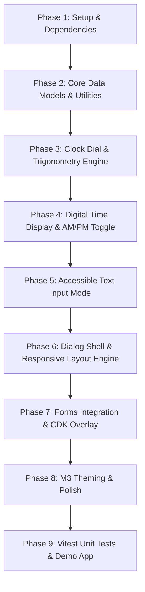

# Material Design 3 (M3) Time Picker — Full Implementation Plan

This document outlines the end-to-end architectural, design, and engineering plan for building the **Material 3 Time Picker** library (`ngx-mat-timepicker`) in Angular.

---

## 1. Objectives & Compliance Standards

- **100% Material 3 (M3) Compliance**: Exact dimensions, token mappings, typography, color roles, corner radii, and elevation levels defined in [M3 Time Picker Specs](https://m3.material.io/components/time-pickers/specs).
- **Dual Mode Support**:
  - **Dial Picker**: Analog clock face with pointer arm, center pin, outer/inner rings, and drag/tap gesture detection.
  - **Input Picker**: Accessible numeric inputs with validation, cursor focus, and supporting helper labels ("Hour", "Minute").
- **Layout Adaptability**:
  - **Vertical (Portrait)** layout for mobile/narrow viewports.
  - **Horizontal (Landscape)** layout for desktop/widescreen viewports.
- **Time Format Versatility**:
  - **12-Hour format** with vertical or horizontal AM/PM segmented toggle.
  - **24-Hour format** with dual concentric rings (1–12 outer, 13–24/00 inner).
- **Enterprise Accessibility (WCAG 2.1 AA / AAA compliant)**: Full keyboard navigation, ARIA slider/dialog patterns, live announcements, and focus trap.
- **Modern Angular Core**: Angular Signals (`signal`, `computed`, `model`, `input`, `output`), modern control flow (`@if`, `@switch`, `@for (...; track ...)`), and strict DI via `inject()`.

---

## 2. Library Component Hierarchy & Architecture

```
ngx-mat-timepicker (Root Module / Public API)
│
├── directives/
│   ├── ngx-mat-timepicker-input.directive.ts   # CVA & input binding ([ngxMatTimepicker]="picker")
│   └── ngx-mat-timepicker-toggle.component.ts   # Icon button trigger ([for]="picker")
│
├── components/
│   ├── ngx-mat-timepicker.component.ts          # Master container & overlay orchestrator
│   ├── ngx-mat-timepicker-dialog.component.ts   # The modal dialog content (M3 surface)
│   ├── time-display/
│   │   ├── time-display.component.ts            # Large digital hour/minute container + colon
│   │   └── period-toggle.component.ts          # Vertical & horizontal AM/PM segmented button
│   ├── clock-dial/
│   │   ├── clock-dial.component.ts              # 256dp circular face, drag/tap gesture handler
│   │   ├── clock-hand.component.ts              # Dynamic selector arm, pin & 48dp handle
│   │   └── clock-numbers.component.ts           # Polar coordinate layout for 12h/24h & minutes
│   ├── time-inputs/
│   │   └── time-inputs.component.ts             # Accessible text boxes, validation & labels
│   └── action-bar/
│       └── action-bar.component.ts              # Mode switch icon (keyboard/clock) + Cancel/OK
│
├── services/
│   ├── timepicker-adapter.service.ts            # Time parsing, formatting, 12h/24h conversions
│   └── timepicker-a11y.service.ts               # Keyboard event translation & live announcements
│
└── themes/
    ├── _tokens.scss                             # M3 CSS variables & sys tokens
    └── timepicker-theme.scss                    # Angular Material M3 theme mixin
```

---

## 3. Mathematical Models & Physics (Clock Dial)

### A. Coordinate System & Trigonometry
The dial is a circle of diameter $D = 256\text{dp}$ with origin $(x_0, y_0) = (128\text{dp}, 128\text{dp})$.

1. **Angle to Value**:
   $$\theta = \operatorname{atan2}(y - y_0, x - x_0) \times \frac{180}{\pi} + 90^\circ$$
   Normalize angle into $[0^\circ, 360^\circ)$:
   $$\theta_{\text{norm}} = (\theta + 360^\circ) \bmod 360^\circ$$

2. **Hour Snapping (12-Hour)**:
   $$\text{Step} = 30^\circ \quad (360^\circ / 12)$$
   $$\text{Hour} = \operatorname{round}\left(\frac{\theta_{\text{norm}}}{30^\circ}\right) \quad (\text{if } 0 \rightarrow 12)$$

3. **Minute Snapping**:
   $$\text{Step} = 6^\circ \quad (360^\circ / 60)$$
   $$\text{Minute} = \operatorname{round}\left(\frac{\theta_{\text{norm}}}{6^\circ}\right) \bmod 60$$

4. **24-Hour Dual-Ring Detection**:
   Distance from center:
   $$r = \sqrt{(x - x_0)^2 + (y - y_0)^2}$$
   - Outer Ring: $r \ge 78\text{dp} \implies \text{Radius} = 100\text{dp}$ (Hours 1–12)
   - Inner Ring: $r < 78\text{dp} \implies \text{Radius} = 68\text{dp}$ (Hours 13–24 or 00)
   - Handle size: Outer ring handle $= 48\text{dp}$; Inner ring handle $= 38\text{dp}$.

---

## 4. UI Specification Matrix

| Component Element | 12-Hour Vertical | 24-Hour Vertical | Horizontal (Landscape) | Input Mode |
|---|---|---|---|---|
| **Dialog Width** | `328dp` | `328dp` | `568dp` | `328dp` |
| **Headline** | `"Select time"` | `"Select time"` | `"Select time"` | `"Enter time"` |
| **Time Box Size** | $96 \times 80\text{dp}$ | $114 \times 80\text{dp}$ | $96 \times 80\text{dp}$ | $96 \times 80\text{dp}$ |
| **Separator** | `:` ($24\text{dp}$ wide) | `:` ($24\text{dp}$ wide) | `:` ($24\text{dp}$ wide) | `:` ($24\text{dp}$ wide) |
| **AM/PM Layout** | Vertical ($52 \times 80\text{dp}$) | *Hidden* | Horizontal ($216 \times 40\text{dp}$) | Vertical ($52 \times 80\text{dp}$) |
| **Dial Face** | $256\text{dp}$ single ring | $256\text{dp}$ concentric rings | $256\text{dp}$ dial | *Replaced by inputs* |
| **Action Bar** | ⌨ (left), Cancel/OK (right) | ⌨ (left), Cancel/OK (right) | ⌨ (left), Cancel/OK (right) | 🕒 (left), Cancel/OK (right) |

---

## 5. Public API Surface

### 1. Directive Binding
```html
<mat-form-field appearance="outline">
  <mat-label>Meeting Time</mat-label>
  <input matInput [ngxMatTimepicker]="picker" [formControl]="timeControl" />
  <ngx-mat-timepicker-toggle matSuffix [for]="picker" />
  <ngx-mat-timepicker #picker [format]="24" [orientation]="'auto'" />
</mat-form-field>
```

### 2. Standalone Inline / Dialog Usage
```html
<ngx-mat-timepicker 
  #picker
  [(value)]="selectedTime"
  [format]="12"
  [min]="minTime"
  [max]="maxTime"
  [stepMinute]="5"
  [autoAdvance]="true"
  (timeSet)="onTimeSet($event)"
  (timeChange)="onTimeChange($event)" />
```

### 3. Component Config Inputs
- `format`: `'12h' | '24h'` (Default: `'12h'`)
- `orientation`: `'vertical' | 'horizontal' | 'auto'` (Default: `'auto'`)
- `mode`: `'dial' | 'input'` (Default: `'dial'`)
- `min`: `string | Date`
- `max`: `string | Date`
- `stepMinute`: `number` (Default: `1`)
- `disabled`: `boolean`
- `touchUi`: `boolean` (Default: `false`)

---

## 6. Detailed Phased Execution Plan



### Phase 1: Environment & Dependencies
1. Install `@angular/cdk` to unlock `Overlay`, `Portal`, `A11y` (`CdkTrapFocus`), and `Bidi`.
2. Configure SCSS tokens matching Material 3 color system (`--mat-sys-primary`, `--mat-sys-surface-container-high`, etc.).
3. Set up workspace demo application to provide an interactive development playground.

### Phase 2: Core Data Models & Service Layer
1. Define interfaces: `TimeSelection`, `TimePickerConfig`, `ClockDialPoint`, `TimeStep` (`'hour' | 'minute'`).
2. Build `TimepickerAdapterService`:
   - Parse and serialize time strings (`HH:mm`, `hh:mm a`).
   - Validate min/max boundaries and format conversions.
3. Build `TimepickerA11yService`:
   - Live announcements (`LiveAnnouncer`) for screen readers.
   - Standardized keyboard event mappings.

### Phase 3: Clock Dial Component
1. Polar-to-Cartesian positioning engine for dial labels.
2. SVG/Canvas selector arm with 8dp center hub and 48dp handle circle.
3. Pointer event listeners (`pointerdown`, `pointermove`, `pointerup`) with global pointer capture.
4. Concentric dual-ring logic for 24-hour mode.
5. Minute interval stepping and smooth CSS transition angles.

### Phase 4: Time Display & Period Selector
1. 80dp high hour and minute container boxes with display-large typography.
2. Active focus states and container transitions.
3. Segmented button component supporting both vertical (80dp H) and horizontal (40dp H) layouts.

### Phase 5: Keyboard Input Mode
1. Two 2-digit text inputs with outline border on focus.
2. Automatic focus traversal (typing 2 digits into Hour automatically focuses Minute).
3. Live validation with M3 error color and subtext.

### Phase 6: Dialog Shell & Responsive Layout
1. Dialog container with 28dp rounded corners (`corner-extra-large`).
2. Breakpoint observer to seamlessly adapt between Vertical and Horizontal orientations.
3. Mode switcher toggle button (⌨ $\leftrightarrow$ 🕒).
4. Cancel and OK action buttons with keyboard dismiss (<kbd>Escape</kbd>) and confirmation (<kbd>Enter</kbd>).

### Phase 7: CDK Overlay & Form Directives
1. Implement `ControlValueAccessor` on `NgxMatTimepickerInputDirective`.
2. Modal overlay with background scrim, click-outside dismissal, and scroll blocking.
3. `NgxMatTimepickerToggleComponent` with customizable icon and ripple effects.

### Phase 8: M3 Styling, Tokens & Light/Dark Mode
1. CSS custom properties adhering strictly to M3 tokens.
2. High contrast and dark mode palette verification.
3. Elevation level 3 shadows and fluid transitions.

### Phase 9: Testing & Documentation
1. Unit tests for trigonometry calculations, time string parsing, and keyboard navigation.
2. Vitest component specs for dial interactions and input validation.
3. Example showcase page demonstrating 12h, 24h, vertical, horizontal, min/max constraints, and reactive form bindings.
